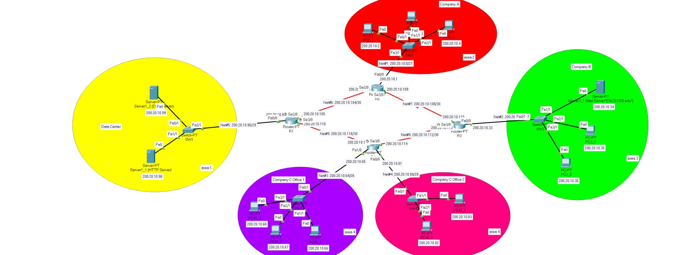

# Packet Tracer

## Description:

This project involves designing and configuring a network topology using Cisco Packet Tracer.
Which perform IP subnetting, configure network devices, and implement routing protocols to ensure network connectivity.
The project is divided into four parts:

## Part 0: IP Subnetting and Assignment

- Assign IP addresses based on a given student ID and create the required subnets for the network topology.

- Document the subnet details in a table, including subnet mask, network IP, broadcast IP, first and last IP, and the maximum number of IPs in each subnet.

## Part 1: Building the Topology

- Build the given network topology in Packet Tracer, using the IP addresses and subnets from Part 0.

- Configure router interfaces and assign static IP addresses to end devices (PCs and servers).

## Part 2: Configuring Servers

- Set up three servers: an HTTP/WEB server and a DNS server in the Data Center network, and a mail server in Company B network.

- Configure the DNS and WEB servers with a specific domain name and create a custom website.

- Set up user accounts on the email server for specific PCs.

## Part 3: Applying Routing Protocol

Implement the Open Shortest Path First (OSPF) routing protocol on all routers, with designated areas for different parts of the network. 

## Part 4: Testing Connectivity, Routes, Website, and Emails

- Test and verify network connectivity using ping and tracert commands.

- Access the configured website from all PCs and verify functionality.

- Document the test results with detailed explanations and screenshots.

### Topology:

